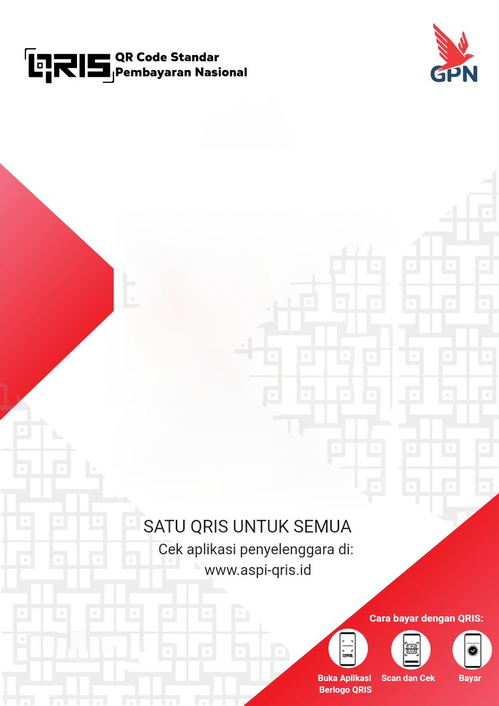
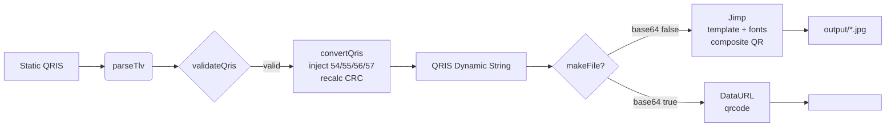

<p align="center">
  
</p>

<h1 align="center">BITS-QRIS-Converter</h1>

<p align="center">
  <strong>Hybrid Terbaik — Core TLV Presisi + Cetak Struk Siap Print</strong><br/>
  Convert QRIS Static → Dynamic dengan validasi CRC, parser EMVCo, dan generator struk JPG.<br/>
  Satu library untuk <strong>Node.js & Browser</strong> — TypeScript, Dual ESM/CJS, CLI.
</p>

<p align="center">
  <a href="https://www.npmjs.com/package/bits-qris-converter"></a>
  <a href="./LICENSE"></a>
  
  
  
  
</p>

<p align="center">
  <a href="#-quick-start">Quick Start</a> •
  <a href="#-cetak-struk">Cetak Struk</a> •
  <a href="#-cli">CLI</a> •
  <a href="#-api-reference">API</a> •
  <a href="#-arsitektur">Arsitektur</a> •
  <a href="#examples">Examples</a>
</p>

---

## ✨ Kenapa BITS?

Kami audit **5 repo QRIS** paling populer (razisek, agungjsp, verssache, Adytm404, justpiple). BITS mengambil **yang terbaik**, membuang yang fragile.

| Masalah Repo Lama | Solusi BITS |
|---|---|
| `split("5802ID")` — gagal jika `Country != ID` | ✅ Parser **TLV rekursif** sesuai spec EMVCo |
| `jimp@0.16.1` vulnerable, `slice(-3)` bug, crash null | ✅ `jimp@1.6.0` + CRC fix + null-safe |
| Tidak ada validator | ✅ `validateQris()` cek **8 required tags + CRC + merchant 26–51** |
| Hanya string, tanpa struk | ✅ `makeFile()` → JPG 1080×1920 + `base64` |
| Hanya CLI sederhana / tanpa CLI | ✅ CLI **interactive + flags** lengkap |
| Hanya CJS atau ESM | ✅ **Dual ESM & CJS** (`import` & `require`) |
| Aset berantakan `font/BebasNeue` | ✅ `assets/fonts/kebab-case` + `assets/images/qris-receipt-template.png` |

> **Hasil:** Library paling **presisi, aman, dan siap produksi** untuk ekosistem QRIS Indonesia.

---

## 🚀 Fitur

- 🔍 **Parser TLV** — decode QRIS ke `QrisData` (merchant, kota, MCC, currency, amount, fee)
- 🔄 **Static → Dynamic** — inject amount & fee (fixed/percentage), recalculate CRC16-CCITT `0x1021`
- 🛡️ **Validator** — prefix `000201`, length, CRC, required tags, merchant info
- 🖨️ **Cetak Struk** — composite QR ke template + overlay NMID/ID/nama/NNS (Jimp), `base64` untuk web
- 🌐 **Browser Ready** — `makeFile(...,{base64:true})` → DataURL, tidak butuh `fs`
- 📦 **Dual Build** — `dist/cjs` + `dist/esm` + `types`, tree-shakeable
- 💻 **CLI** — `npx bits-qris` interactive atau `—convert —validate —parse`
- 🎨 **Aset Clean** — `kebab-case` semantik (`title-bebas-neue`, `body-roboto-large`)
- ⚡ **Performa** — `Intl` cache, Jimp cache, `pure functions`, 0 `any` kritis

---

## 📦 Instalasi

```bash
npm i bits-qris-converter
# yarn add bits-qris-converter
# pnpm add bits-qris-converter

# cek instalasi
node -e "import('bits-qris-converter').then(m=>console.log(Object.keys(m).slice(0,5)))"
```

**Requirements:** Node.js `>=16`, modern browser (ES2022).

---

## ⚡ Quick Start

### Modern API (Direkomendasikan)

```typescript
import { convertQris, parseQris, validateQris } from 'bits-qris-converter';

const staticQris = '00020101021126560014ID.CO.QRIS.WWW0115ID10231625260990215ID10231625260995204581253033605802ID5914TOKO BITS JAYA6007JAKARTA61051234563049BBB';

// 1. Validasi dulu (opsional tapi disarankan)
const { valid, errors } = validateQris(staticQris);
if (!valid) console.error(errors);

// 2. Parse info merchant
const info = parseQris(staticQris);
console.log(info.merchantName); // TOKO BITS JAYA
console.log(info.merchantCity); // JAKARTA
console.log(info.method);       // static

// 3. Convert → Dynamic
const dynamic = convertQris(staticQris, {
  amount: 50_000,
  fee: { type: 'fixed', value: 1000 } // atau { type: 'percentage', value: 2.5 }
});
console.log(dynamic); // ...540550000...6304ABCD (CRC baru)
```

### Legacy API (Kompatibel `qris-dinamis 1.x`)

```typescript
import { makeString, makeFile } from 'bits-qris-converter';

// Tetap jalan
const dynamic = makeString(staticQris, { nominal: '50000', taxtype: 'r', fee: '1000' });
const file = await makeFile(staticQris, { nominal: '50000', base64: false });
```

---

## 🖨️ Cetak Struk

Fitur unggulan BITS — tidak ada di `verssache`.

```typescript
import { makeFile, makeQrDataUrl, getMerchantInfo } from 'bits-qris-converter';

// 1. Simpan JPG struk (Node.js)
const path = await makeFile(staticQris, {
  amount: 75_000,
  fee: { type: 'percentage', value: 2 },
  path: 'output/struk-75000.jpg', // default: output/<MERCHANT>-<timestamp>.jpg
});
console.log(path); // output/struk-75000.jpg

// 2. Base64 untuk API / 
const base64 = await makeFile(staticQris, { amount: 75_000, base64: true });
//   // data:image/jpeg;base64,...

// 3. QR ringan tanpa template (tanpa Jimp, 5KB)
const qrDataUrl = await makeQrDataUrl(staticQris, { amount: 50_000 });
console.log(qrDataUrl.slice(0, 30)); // data:image/png;base64,iVBORw...

// 4. Info merchant untuk overlay kustom
const merchant = getMerchantInfo(staticQris);
console.log(merchant.nmid);        // ID1023162526099
console.log(merchant.merchantName); // TOKO BITS JAYA
console.log(merchant.nns);         // 8-char NNS

// 5. Template kustom
await makeFile(staticQris, {
  amount: 50_000,
  templatePath: 'assets/images/custom-template.png', // 1080x1920 PNG
});
```

**Output Node.js:** QR 512×512 di-composite ke `assets/images/qris-receipt-template.png` (1080×1920) + teks `NMID`, `ID`, `Merchant Name`, `NNS | City`.

| Font | File | Fungsi |
|---|---|---|
| `title-bebas-neue` (90) | `assets/fonts/title-bebas-neue/...` | Nama merchant pendek |
| `title-bebas-neue-compact` (60) | `assets/fonts/title-bebas-neue-compact/...` | Nama panjang >18 char |
| `body-roboto-large` (35) | `assets/fonts/body-roboto-large/...` | NMID & ID |
| `body-roboto-medium` | `assets/fonts/body-roboto-medium/...` | Fallback |
| `caption-roboto-small` | `assets/fonts/caption-roboto-small/...` | Footer `Dicetak oleh: NNS` |

> Di **Browser** `makeFile` otomatis fallback ke `QR DataURL` (template butuh `fs`). Selalu pakai `{ base64: true }`.

---

## 🌐 Browser

```typescript
import { convertQris, validateQris } from 'bits-qris-converter';

const dynamic = convertQris(qris, { amount: 100_000 });
console.log(validateQris(dynamic).valid); // true

import { makeFile } from 'bits-qris-converter';
const dataUrl = await makeFile(qris, { amount: 100_000, base64: true });
document.querySelector<HTMLImageElement>('#qr')!.src = dataUrl;
```

---

## 💻 CLI

```bash
# Interactive wizard (parse → amount → fee → struk)
npx bits-qris
# atau
npx bits-qris-converter

# One-liner
npx bits-qris --validate "000201010211..."
# {"valid":true,"errors":[]}

npx bits-qris --parse "000201010211..."
# {"merchantName":"TOKO BITS JAYA", "merchantCity":"JAKARTA", ...}

npx bits-qris --convert "000201010211..." 50000
# 000201010212...540550000...6304ABCD

npx bits-qris --convert "000201010211..." 50000 --fee 1000 --type fixed --image output/struk.jpg
# 000201010212... + [image] Saved to: output/struk.jpg

npx bits-qris --convert "000201010211..." 50000 --base64
# [base64] data:image/jpeg;base64,/9j/4AAQSkZJRgABAQ...

npx bits-qris --help
```

### 📦 Tambahkan ke `package.json` (biar `npm run` lebih singkat)

Copy ini ke `package.json` project kamu (Next.js / SvelteKit / Express):

```json
{
  "scripts": {
    "qris": "bits-qris",
    "qris:help": "bits-qris --help",
    "qris:validate": "bits-qris --validate",
    "qris:parse": "bits-qris --parse",
    "qris:convert": "bits-qris --convert",
    "qris:interactive": "bits-qris",
    "qris:demo": "bits-qris --convert \"00020101021126560014ID.CO.QRIS.WWW0115ID10231625260990215ID10231625260995204581253033605802ID5914TOKO BITS JAYA6007JAKARTA61051234563049BBB\" 25000 --image output/demo.jpg"
  }
}
```

Pakai dengan `--` double-dash agar argumen diteruskan:

```bash
npm run qris:interactive
npm run qris:validate -- "000201010211..."
npm run qris:parse -- "000201010211..."
npm run qris:convert -- "000201010211..." 50000
npm run qris:convert -- "000201010211..." 50000 --fee 1000 --type fixed
npm run qris:convert -- "000201010211..." 50000 --fee 2.5 --type percentage --image output/struk.jpg --base64
npm run qris:demo
```

> Tips: Untuk QRIS panjang, simpan di `.env` → `QRIS_STATIC="000201..."` lalu `npm run qris:convert -- "$QRIS_STATIC" 50000`

---

## 📚 API Reference

### Core

| Fungsi | Params | Return | Deskripsi |
|---|---|---|---|
| `parseTlv(data)` | `string` | `TlvElement[]` | Low-level TLV EMVCo |
| `parseQris(qris)` | `string` | `QrisData` | Parse struktur lengkap |
| `validateQris(qris)` | `string` | `{valid, errors}` | Validasi 8 required tags + CRC |
| `isValidQris(qris)` | `string` | `boolean` | Shortcut |
| `calculateCrc16(str)` | `string` | `string` | CRC16-CCITT `0x1021` |
| `convertQris(qris, opts)` | `string, ConvertOptions` | `string` | **Static → Dynamic** |
| `makeString(qris, opts)` | `string, opts` | `string` | Alias legacy+modern |
| `getMerchantInfo(qris)` | `string` | `MerchantInfo` | NMID, printer, NNS |

**Deprecated uppercase alias tetap ada** untuk kompatibilitas: `parseQRIS`, `convertQRIS`, `validateQRIS`, `calculateCRC16`.

```typescript
type ConvertOptions = {
  amount: number | string;
  fee?: { type: 'fixed' | 'percentage'; value: number | string };
};

type QrisData = {
  version: string;
  method: 'static' | 'dynamic';
  merchantAccountInfo: MerchantAccountInfo[];
  merchantCategoryCode: string;
  currency: string; // 360 = IDR
  amount?: string;
  countryCode: string;
  merchantName: string;
  merchantCity: string;
  crc: string;
  raw: TlvElement[];
};
```

### Image

| Fungsi | Params | Return |
|---|---|---|
| `makeFile(qris, opts)` | `ImageOptions` | `Promise<string>` — path atau base64 |
| `makeImage` / `generateStruk` | — | alias `makeFile` |
| `makeQrDataUrl(qris, opts)` | `QrOnlyOptions` | `Promise<string>` DataURL |
| `makeQrBuffer(qris, opts)` | `QrOnlyOptions` | `Promise<Buffer>` |
| `formatRupiah(v)` | `number\|string` | `string` `Rp 50.000` |

```typescript
type ImageOptions = ConvertOptions & {
  nominal?: string | number; // legacy alias
  taxtype?: 'p' | 'r';
  base64?: boolean;          // default false
  path?: string;
  templatePath?: string;     // default assets/images/qris-receipt-template.png
};
```

### Shared

```typescript
import { QrisError, QrisParseError, QrisConvertError, QrisImageError, formatRupiah, padLength, sanitizeFilename } from 'bits-qris-converter';
```

---

## 🧩 Examples

```bash
# lihat folder examples/
node examples/basic.mjs      # ESM modern
node examples/legacy.cjs     # CJS legacy
```

```typescript
// examples/basic.mjs
import { convertQris, makeFile, parseQris } from 'bits-qris-converter';

const QRIS = '00020101021126560014ID.CO.QRIS.WWW0115ID10231625260990215ID10231625260995204581253033605802ID5914TOKO BITS JAYA6007JAKARTA61051234563049BBB';

const dynamic = convertQris(QRIS, { amount: 25_000 });
console.log(parseQris(dynamic).amount); // 25000

const file = await makeFile(QRIS, { amount: 25_000 });
console.log('Struk:', file); // output/TOKO_BITS_JAYA-...jpg
```

---

## 🏗️ Arsitektur



**Struktur Project — Clean & Maintainable:**
```
bits-qris-converter/
├── src/
│   ├── core/               # pure, no I/O
│   │   ├── constants.ts    # TAG, REQUIRED_TAGS
│   │   ├── types.ts        # TlvElement, QrisData
│   │   ├── crc16.ts
│   │   ├── parser.ts       # parseTlv, parseQris
│   │   ├── converter.ts
│   │   ├── validator.ts
│   │   └── index.ts
│   ├── shared/             # cross-cutting
│   │   ├── errors.ts       # QrisError hierarchy
│   │   └── format.ts       # Intl cache
│   ├── image/
│   │   ├── types.ts
│   │   ├── merchant-info.ts
│   │   ├── qr-renderer.ts
│   │   ├── font-loader.ts  # cached Jimp
│   │   ├── template-resolver.ts
│   │   ├── receipt-generator.ts
│   │   └── index.ts
│   ├── cli/
│   │   ├── constants.ts
│   │   ├── parser.ts
│   │   ├── commands.ts
│   │   └── interactive.ts
│   ├── index.ts            # public barrel (ESM+CJS)
│   └── cli.ts              # bin wrapper
├── assets/
│   ├── images/qris-receipt-template.png  # 1080×1920
│   └── fonts/              # kebab-case semantic
│       ├── title-bebas-neue/
│       ├── title-bebas-neue-compact/
│       ├── body-roboto-large/
│       ├── body-roboto-medium/
│       └── caption-roboto-small/
├── examples/
├── dist/                   # build (esm+cjs)
└── package.json
```

**Coding Standard:** `kebab-case` file, `PascalCase` type, `camelCase` function, `ESLint` + `Prettier`, `strict` TS, `pure functions`, `no any` kritis.

---

## 🛡️ Keamanan & Validasi

- CRC16-CCITT `0x1021` init `0xFFFF` — sesuai EMVCo
- Validasi 8 required tags + merchant 26–51 + CRC mismatch
- `jimp@1.6.0` (0 vuln) bukan `0.16.1` vulnerable
- Tidak pernah `eval`, tidak `split("5802ID")` fragile

---

## ⚙️ Tech Stack

| Layer | Tech |
|---|---|
| Language | TypeScript 5.7 (strict) |
| QR Generate | `qrcode` 1.5.4 |
| Image | `jimp` 1.6.0 |
| Build | `tsc` dual ESM/CJS |
| Lint/Format | ESLint 9 + Prettier 3 |
| Runtime | Node ≥16, Browser ES2022 |

---

## 🧪 Testing & Publish

```bash
npm run build        # clean + build:esm + build:cjs + copy:assets
npx tsc --noEmit     # type check
npx eslint src --ext .ts
npm pack --dry-run   # cek 230 files, 952KB
npm publish --access public
npm view bits-qris-converter version
```

---

## 🤝 Contributing

PR sangat diterima!

1. Fork → `git checkout -b feat/keren`
2. `npm install && npm run build`
3. `npm run lint && npx tsc --noEmit`
4. Commit `feat: ...` → Push → PR

**Custom template:** taruh `1080×1920` PNG di `assets/images/custom.png` dan panggil `makeFile(qris,{amount, templatePath:'assets/images/custom.png'})`. Font `.fnt` taruh di `assets/fonts/<kebab-case>/`.

---

## 📄 License

MIT © 2026 BITS — Bina Inovasi Teknologi Solusi.<br/>
Original inspirations (MIT): `verssache/qris-dinamis`, `agungjsp/Dynamic-QRIS`, `razisek/Qris-Dinamis` — terima kasih!

Lihat [`LICENSE`](./LICENSE) untuk detail.

---

<p align="center">
  Dibuat dengan ❤️ untuk ekosistem QRIS Indonesia —<br/>
  <strong>BITS: Bikin QRIS Jadi Dinamis, Clean & Siap Produksi.</strong>
</p>
